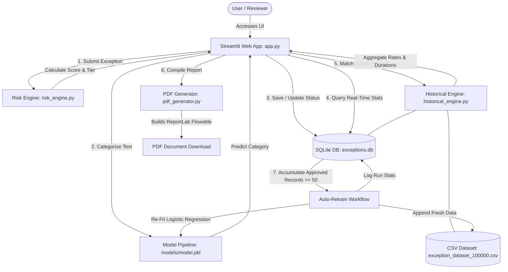

# Enterprise Exception Management & Risk Assessment System

The application has been deployed on [http://35.154.27.51/](http://35.154.27.51/) on AWS for live demonstration purpose.

An intelligent, AI-driven platform for managing enterprise security and policy exceptions. This system automates the lifecycle of policy exceptions, covering submission, automated risk scoring, machine learning-based classification, historical lookups, formal approvals, and compliance report generation.

It features a dual-source analytics dashboard, an automated ML model retraining pipeline, and high-fidelity PDF report generation.

---

## Features

### 1. Machine Learning-Driven Classification
* Automatically predicts policy exception categories (e.g., *IAM*, *Network Security*, *Cloud Security*, *Patch Management*) from natural language descriptions.
* Employs a text-processing pipeline containing a `TfidfVectorizer` paired with a classification model serialized via `joblib`.

### 2. Dual-Source Analytics Dashboard
* Supports real-time switching between:
  * **Live Exception Database**: Monitored SQLite instance showing pending, approved, and rejected workflows.
  * **ML Training Dataset**: Historical analysis of 100,000 synthetic exception records.
* Provides toggles for **KPIs (Key Performance Indicators)** and **KRIs (Key Risk Indicators)** (such as Critical Exception Rates, Rejection Rates, and Long-Duration Exceptions).
* Renders interactive Plotly visualisations (Pie Charts, Bar Charts, Grouped Histograms, Scatter Plots) for risk scores, business units, and status metrics.

### 3. Deterministic Risk Scoring Engine
* Computes composite, transparent risk scores on a 0 to 100 scale using fixed point weights across five dimensions:
  * Asset Criticality (High=30, Medium=20, Low=10)
  * Business Impact (High=25, Medium=15, Low=8)
  * Compliance Impact (High=20, Medium=10, Low=5)
  * Threat Exposure (High=15, Medium=8, Low=4)
  * Duration ( >90 days = 10, 46-90 days = 7, <=45 days = 5 )
* Classifies exceptions into four distinct tiers: **Low** (<40), **Medium** (>=40), **High** (>=70), and **Critical** (>=90).

### 4. Intelligent Historical Lookups
* Prefix-matches the first 15 characters of new descriptions against the combined 100,000 historical dataset and live DB logs.
* Computes historical approval rates, recommended exception durations, and confidence levels (Low, Medium, High) based on similar past exceptions.

### 5. Decision Workflow & Auditing
* Supports lifecycle states: `Pending`, `Under Review`, `Approved`, `Rejected`, and `Expired`.
* Audit features allow tracking approver details (name, employee ID, title/role) and custom rejection reasons.

### 6. Automated PDF Document Generation
* Generates compliance-ready, high-fidelity PDF reports using ReportLab.
* Features custom color-coded risk badges, structured metadata tables, historical intelligence blocks, and a formal signature/approval block.

### 7. Continuous ML Retraining & Pipeline Upgrade
* Triggers an automated retraining run when 50 or more new approved exceptions accumulate.
* Promotes the model pipeline from Multinomial Naive Bayes to a high-capacity **Logistic Regression classifier** with bi-gram support.
* Appends new approved records back into the CSV dataset to prevent drift.
* Logs training history (timestamp, records used, validation accuracy, notes) to `ml_retrain_log`.

---

## System Architecture

The workflow below illustrates how users, databases, rules engines, and ML models interact within the platform:



---

## Project Structure

```
Enterprise_Exception_Management/
│
├── app.py                      # Main Streamlit Web Application (Layout, UI, Dashboard, Retraining flow)
├── classifier.py               # Initial model trainer (TF-IDF + Naive Bayes, Stratified Split, 5-Fold CV)
├── database.py                 # SQLite helper module to initialize, migrate, and inspect exceptions.db
├── decision_engine.py          # Rule-based decision recommendation logic
├── generate_dataset.py         # Synthetic dataset generator for bootstrapping testing and ML training
├── historical_engine.py        # Prefix-matching engine querying both CSV and SQLite databases
├── pdf_generator.py            # High-fidelity compliance report generator using ReportLab
├── risk_engine.py              # Point-based security and business risk calculator
├── similarity_engine.py        # Text similarity engine using TF-IDF and Cosine Similarity
│
├── exception_templates.csv     # Base descriptions and categories used by generate_dataset.py
├── exception_dataset_100000.csv# Bootstrapped synthetic training set (100,000 records)
├── exceptions.db               # Live database file (SQLite)
├── requirements.txt            # Python library dependencies
│
├── database/                   # Empty placeholder directory for database utilities
├── models/                     # Holds serialized model (model.pkl)
├── reports/                    # Target directory for generated PDF reports
└── screenshots/                # Optional directory for interface screenshots
```

---

## Database Schema

The SQLite database (`exceptions.db`) is structured to support both audit compliance and machine learning feedback loops:

### 1. `exceptions` Table
This table stores all exception metadata, approval workflows, risk factors, and ML retraining logs.

| Column | Type | Description |
| :--- | :--- | :--- |
| `id` | `INTEGER` | Primary Key, Auto-increment. |
| `exception_id` | `TEXT` | Unique, human-readable identifier (e.g., `EX000001`). |
| `description` | `TEXT` | Natural language justification for the policy waiver. |
| `category` | `TEXT` | Security category classification (predicted by ML model). |
| `business_unit` | `TEXT` | Submitting organizational department. |
| `asset_name` | `TEXT` | Hardware/Software system requesting the exception. |
| `asset_criticality` | `TEXT` | Asset tier: `Low`, `Medium`, `High`. |
| `business_impact` | `TEXT` | Potential operational fallout if compromised. |
| `compliance_impact` | `TEXT` | Regulatory compliance exposure. |
| `threat_exposure` | `TEXT` | Likelihood of threat vector exploitability. |
| `duration_days` | `INTEGER` | Duration for which the waiver is valid. |
| `risk_score` | `INTEGER` | Composite score calculated by `risk_engine.py`. |
| `risk_level` | `TEXT` | Final risk tier (`Low`, `Medium`, `High`, `Critical`). |
| `recommendation` | `TEXT` | Automated action recommendations (e.g. *Approve with Controls*). |
| `status` | `TEXT` | Workflow state: `Pending`, `Under Review`, `Approved`, `Rejected`, `Expired`. |
| `requested_by` | `TEXT` | Employee identifier of the requester. |
| `risk_owner` | `TEXT` | Designated manager owning the risk. |
| `created_date` | `TEXT` | Creation date (YYYY-MM-DD). |
| `expiry_date` | `TEXT` | Calculated expiration date (YYYY-MM-DD). |
| `approved_date` | `TEXT` | Approval date (YYYY-MM-DD). |
| `approved_datetime` | `TEXT` | Detailed approval timestamp (YYYY-MM-DD HH:MM:SS). |
| `approved_by` | `TEXT` | Audit string combining Approver name, ID, and Title. |
| `approver_id` | `TEXT` | Employee ID of the final approver. |
| `approver_title` | `TEXT` | Job title/role of the final approver. |
| `rejection_reason` | `TEXT` | Justification notes if status is updated to `Rejected`. |
| `ml_retrained` | `INTEGER` | Boolean flag (0 or 1) indicating if the record has been fed back to retrain the ML model. |
| `created_at` | `TIMESTAMP` | System creation timestamp. |

### 2. `ml_retrain_log` Table
Stores metrics about every automated retraining loop run.

| Column | Type | Description |
| :--- | :--- | :--- |
| `id` | `INTEGER` | Primary Key, Auto-increment. |
| `retrained_at` | `TIMESTAMP` | Timestamp of the retraining run. |
| `records_used` | `INTEGER` | Number of approved SQLite exception records incorporated. |
| `accuracy` | `REAL` | Validation accuracy (0.0 - 1.0) achieved by the newly fitted model. |
| `notes` | `TEXT` | Log notes and timestamps. |

---

## Installation & Setup

### Prerequisites
* Python 3.8 or higher
* `venv` (Python Virtual Environment tool)

### Step 1: Clone the Repository & Navigate to Directory
```bash
cd Enterprise_Exception_Management
```

### Step 2: Create and Activate Virtual Environment
On Windows (PowerShell):
```powershell
python -m venv venv
.\venv\Scripts\Activate.ps1
```
On macOS/Linux:
```bash
python3 -m venv venv
source venv/bin/activate
```

### Step 3: Install Required Dependencies
```bash
pip install -r requirements.txt
```

### Step 4: Initialize the SQLite Database & Run Migrations
Run the standalone database script to build local tables and apply standard migrations:
```bash
python database.py
```

### Step 5: (Optional) Generate the Synthetic Dataset
If `exception_dataset_100000.csv` is not present, generate the 100,000 synthetic dataset:
```bash
python generate_dataset.py
```

### Step 6: Train the Initial Machine Learning Model
Train the initial Naive Bayes classifier on the synthetic dataset and serialize the pipeline:
```bash
python classifier.py
```

### Step 7: Launch the Web App
Run the Streamlit application:
```bash
streamlit run app.py
```
A browser tab will automatically open at `http://localhost:8501`.

---

## Core Components & Mechanics

### 1. Risk Scoring Engine (`risk_engine.py`)
Calculates risk scores by summing weighted values from five core inputs:
* **Asset Criticality**: High = 30 | Medium = 20 | Low = 10
* **Business Impact**: High = 25 | Medium = 15 | Low = 8
* **Compliance Impact**: High = 20 | Medium = 10 | Low = 5
* **Threat Exposure**: High = 15 | Medium = 8 | Low = 4
* **Duration (Days)**: >90 Days = 10 | 46–90 Days = 7 | <=45 Days = 5

The total score (maximum 100) maps directly to a **Risk Level**:
* `score >= 90`: **Critical**
* `score >= 70`: **High**
* `score >= 40`: **Medium**
* `score < 40`: **Low**

This module produces transparent, deterministic, and auditable risk assessments with no model inference involved.

### 2. Historical Intelligence (`historical_engine.py`)
To prevent duplicate requests and review delays, this engine scans historical records sharing the same description prefix (first 15 characters).
It returns:
* **Match Count**: Combined count of matches found in CSV and live SQLite DB.
* **Approval Rate**: Percentage of matched exceptions that reached an `Approved` state.
* **Confidence Level**:
  * High: Approval rate $\ge 80\%$
  * Medium: Approval rate $\ge 60\%$
  * Low: Approval rate $< 60\%$
* **Recommended Duration**: Average duration of matched approvals, capped at 30 days.

### 3. PDF Compliance Reports (`pdf_generator.py`)
Utilises ReportLab Flowables to construct detailed, single-page PDF reports.
* Styles include a deep corporate palette (Navy/Hex `#1a1f36` for headers, specific Hex codes for Critical/High/Medium risk levels).
* Organised into five sections:
  1. Exception Details
  2. Risk Assessment
  3. Historical Intelligence (if match exists)
  4. AI Recommendation
  5. Approval Details
* Features a light-green signature block verifying the approver audit trail.

### 4. ML Model Retraining Loop (`app.py` -> `attempt_retrain()`)
To adapt to evolving security demands, the system supports online retraining:
1. **Accumulation**: Approved exceptions are saved in `exceptions.db` with `ml_retrained = 0`.
2. **Trigger**: When the "Pending Retraining" count reaches **50**, the **ML Retraining** panel enables the "Retrain Model Now" action.
3. **Pipeline Upgrade**: The engine fits a fresh pipeline:
   * **Vectoriser**: `TfidfVectorizer` configured with n-grams (1, 2) and a 10,000 feature limit.
   * **Classifier**: Promoted to `LogisticRegression` (with C=1.0, max_iter=300) to better map nuanced language.
4. **Data Injection**: Writes records back to `exception_dataset_100000.csv` to expand the base training set.
5. **Marking**: Resets database flags (`ml_retrained = 1`) and writes metrics back to `ml_retrain_log`.

---

## Security & Best Practices
* **Data Privacy**: The platform runs entirely locally. Databases (`exceptions.db`) and models (`model.pkl`) are hosted on-premise without external API dependency.
* **Auditability**: Approval workflows enforce the identification of roles (CISO, IT managers, etc.) and record cryptographic-like textual anchors for compliance audits.
* **Local Temp Cleanups**: PDF reports are written using ReportLab and compiled immediately, reducing system memory footprints.


